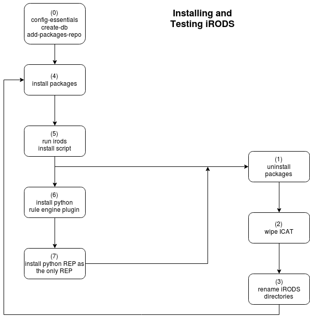

installing iRODS (for beginners)
---
We'll assume, as the starting point, a freshly installed Ubuntu 16 or 18 OS on a 64-bit Intel platform.

A docker container can be used, but the first steps must be the installation of git and the cloning a local `ubuntu_irods_install` repo:

```
$ docker run -it ubuntu:16.04
```
Once inside the container do the following (using `sudo` if not root):
```
(container) /# sudo apt update && sudo apt install -y git sudo
(container) /# git clone http://github.com/d-w-moore/ubuntu_irods_installer && cd ubuntu_irods_installer
```
(Enter your login password when/if prompted.  In Ubuntu 16/18, if you're not in the
`sudo` group, you may need help from your admin.

We can now run through the phases in the diagram.

  - set up password-less `sudo`:
  ```
  ./install.sh  --w=sudo-without-pw 0
  ```
  (Again, enter password if prompted.)

  - install prerequisites and set up `ICAT` database
  ```
  (container) /ubuntu_irods_install# ./install.sh --w='config-essentials create-db add-package-repo' 0
  ```
  - install and set up iRODS
  ```
  (container) /ubuntu_irods_install# ./install.sh -r 4 5
  ```
  - The container now has a running instance of the iRODS server.  We can become the `irods` (service account) user and issue an icommand of our choice, to test:
  ```
  $ (container) /ubuntu_irods_install# sudo su - irods
  $ (container) irods: ~$ ils
  /tempZone/home/rods

  ```
